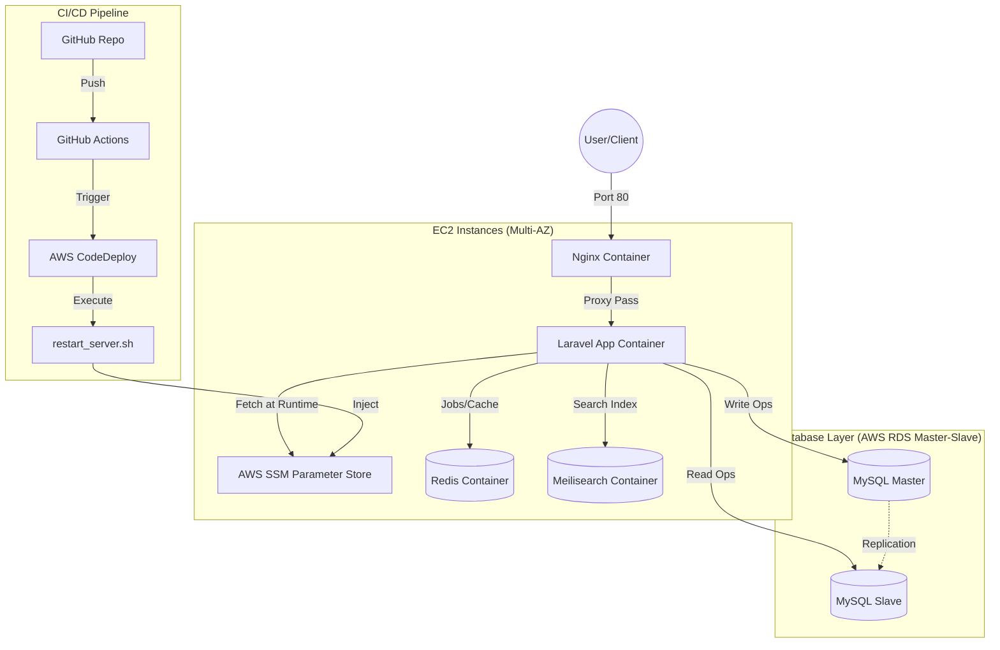

# Laravel Backend API (Current State)

Backend API built with Laravel 12 for two modules currently present in codebase:
- Trello-style project/task management (Sanctum protected)
- Job board search + AI summary endpoints (public, throttled)

## Tech Stack

- PHP 8.2+
- Laravel 12
- MySQL 8
- Laravel Sanctum (token auth)
- Laravel Scout + Meilisearch (job search)
- Redis/Cache support
- Pest + PHPUnit for testing
- Docker / Docker Compose
- GitHub Actions CI/CD
- Terraform (AWS EC2 + Security Group)
- Kubernetes manifest (MySQL deployment/service)

## Implemented Features

### 1) Auth + Trello-style API (Protected)

- `POST /api/auth/register`
- `POST /api/auth/login`
- `GET /api/auth/me` (auth:sanctum)
- `POST /api/auth/logout` (auth:sanctum)
- Project CRUD under `/api/projects`
- Task CRUD under `/api/projects/{project}/tasks`
- Task statuses endpoint: `GET /api/statuses`
- Policy-based authorization for user-owned resources
- Form Request validation + unified API error responses

### 2) Jobs API (Public + Rate Limited)

All under `throttle:60,1`:
- `GET /api/jobs` (supports `search`, `location`, `per_page`)
- `POST /api/jobs`
- `POST /api/jobs/{id}/summarize`
- `GET /api/jobs/{id}/summary`

Details:
- Search uses Scout (`Job::search`) and Meilisearch driver in normal env.
- Summary generation uses queued `SummarizeJob` with retry/backoff.
- AI abstraction via `AIServiceInterface` bound to `GeminiService`.
- Summary is cached (`job_summary_{id}`, TTL 1 hour).

### 3) Security + Middleware

Global custom middleware:
- `X-Frame-Options: DENY`
- `X-Content-Type-Options: nosniff`
- `X-XSS-Protection: 1; mode=block`

Configured in `bootstrap/app.php`.

## Dummy Endpoint Examples (All APIs)

Base URL:

```bash
http://127.0.0.1:8000
```

Set token after login/register:

```bash
TOKEN="paste_your_bearer_token_here"
```

### Auth

`POST /api/auth/register`

```bash
curl -X POST http://127.0.0.1:8000/api/auth/register \
  -H "Content-Type: application/json" \
  -d '{
    "name":"Aldo",
    "email":"aldo@example.com",
    "password":"Password123!",
    "password_confirmation":"Password123!"
  }'
```

`POST /api/auth/login`

```bash
curl -X POST http://127.0.0.1:8000/api/auth/login \
  -H "Content-Type: application/json" \
  -d '{
    "email":"aldo@example.com",
    "password":"Password123!"
  }'
```

`GET /api/auth/me`

```bash
curl http://127.0.0.1:8000/api/auth/me \
  -H "Authorization: Bearer $TOKEN"
```

`POST /api/auth/logout`

```bash
curl -X POST http://127.0.0.1:8000/api/auth/logout \
  -H "Authorization: Bearer $TOKEN"
```

### Projects

`GET /api/projects`

```bash
curl http://127.0.0.1:8000/api/projects \
  -H "Authorization: Bearer $TOKEN"
```

`POST /api/projects`

```bash
curl -X POST http://127.0.0.1:8000/api/projects \
  -H "Authorization: Bearer $TOKEN" \
  -H "Content-Type: application/json" \
  -d '{
    "name":"Sprint Board",
    "description":"Tasks for sprint 1"
  }'
```

`GET /api/projects/{project}`

```bash
curl http://127.0.0.1:8000/api/projects/1 \
  -H "Authorization: Bearer $TOKEN"
```

`PUT /api/projects/{project}`

```bash
curl -X PUT http://127.0.0.1:8000/api/projects/1 \
  -H "Authorization: Bearer $TOKEN" \
  -H "Content-Type: application/json" \
  -d '{
    "name":"Sprint Board v2",
    "description":"Updated sprint board"
  }'
```

`DELETE /api/projects/{project}`

```bash
curl -X DELETE http://127.0.0.1:8000/api/projects/1 \
  -H "Authorization: Bearer $TOKEN"
```

### Tasks

`GET /api/statuses`

```bash
curl http://127.0.0.1:8000/api/statuses \
  -H "Authorization: Bearer $TOKEN"
```

`GET /api/projects/{project}/tasks`

```bash
curl http://127.0.0.1:8000/api/projects/1/tasks \
  -H "Authorization: Bearer $TOKEN"
```

`POST /api/projects/{project}/tasks`

```bash
curl -X POST http://127.0.0.1:8000/api/projects/1/tasks \
  -H "Authorization: Bearer $TOKEN" \
  -H "Content-Type: application/json" \
  -d '{
    "title":"Build login page",
    "description":"Implement login UI + validation",
    "status":"pending",
    "due_date":"2026-03-10"
  }'
```

`GET /api/projects/{project}/tasks/{task}`

```bash
curl http://127.0.0.1:8000/api/projects/1/tasks/1 \
  -H "Authorization: Bearer $TOKEN"
```

`PUT /api/projects/{project}/tasks/{task}`

```bash
curl -X PUT http://127.0.0.1:8000/api/projects/1/tasks/1 \
  -H "Authorization: Bearer $TOKEN" \
  -H "Content-Type: application/json" \
  -d '{
    "title":"Build login page",
    "description":"Done backend integration",
    "status":"in_progress"
  }'
```

`DELETE /api/projects/{project}/tasks/{task}`

```bash
curl -X DELETE http://127.0.0.1:8000/api/projects/1/tasks/1 \
  -H "Authorization: Bearer $TOKEN"
```

### Jobs (Public, Throttled)

`GET /api/jobs`

```bash
curl "http://127.0.0.1:8000/api/jobs?search=laravel&location=remote&per_page=10"
```

`POST /api/jobs`

```bash
curl -X POST http://127.0.0.1:8000/api/jobs \
  -H "Content-Type: application/json" \
  -d '{
    "title":"Laravel Developer",
    "location":"Remote",
    "description":"Build and maintain Laravel APIs",
    "company_id":1
  }'
```

`POST /api/jobs/{id}/summarize`

```bash
curl -X POST http://127.0.0.1:8000/api/jobs/1/summarize
```

`GET /api/jobs/{id}/summary`

```bash
curl http://127.0.0.1:8000/api/jobs/1/summary
```

## Local Setup

1. Install dependencies

```bash
composer install
```

2. Copy env and configure

```bash
cp .env.example .env
```

Set at minimum:

```env
APP_NAME=TrelloLite
APP_ENV=local
APP_KEY=
APP_DEBUG=true
APP_URL=http://localhost

DB_CONNECTION=mysql
DB_HOST=127.0.0.1
DB_PORT=3306
DB_DATABASE=trello_test_aldo
DB_USERNAME=root
DB_PASSWORD=

SCOUT_DRIVER=meilisearch
MEILISEARCH_HOST=http://127.0.0.1:7700
MEILISEARCH_KEY=masterKey

GEMINI_API_KEY=
```

3. App key + migrate

```bash
php artisan key:generate
php artisan migrate
```

4. Run app

```bash
php artisan serve
```

## Run with Docker

### Prerequisites

- [Docker](https://docs.docker.com/get-docker/) with the **Compose plugin** (`docker compose version`).
- Ports free on the host: HTTP (see `APP_PORT` below, default **8080**), **7700** (Meilisearch), **6380** (Redis mapped from container 6379).

### Services (`docker-compose.yml`)

| Service | Role |
|--------|------|
| `nginx-gateway` | Nginx → `app:9000` (PHP-FPM); publishes `${APP_PORT:-80}:80` |
| `app` | Laravel (PHP-FPM) |
| `worker` | `php artisan queue:work` (queues, e.g. job summaries) |
| `db` | MySQL 8 (master / writes) |
| `mysql-slave` | MySQL 8 (read replica; manual sync—see below) |
| `redis` | Cache, sessions, queues |
| `meilisearch` | Scout search |

### 1. Environment file

From the project root:

```bash
cp .env.example .env
```

For containers talking to each other on the Compose network, set **service names as hosts** (not `127.0.0.1`). Align DB credentials with `docker-compose.yml` (`MYSQL_*` on the `db` service: database `trello_test_aldo`, user/password `root` / `root` as configured there).

Minimal Docker-oriented values (adjust `APP_PORT` / `APP_URL` if you change the host port):

```env
APP_URL=http://localhost:8080
APP_PORT=8080

DB_CONNECTION=mysql
DB_HOST=db
# Local dev without replication: use `db` so reads see migrated tables. Use `mysql-slave` only after syncing (see "MySQL Master/Slave").
DB_SLAVE_HOST=db
DB_PORT=3306
DB_DATABASE=trello_test_aldo
DB_USERNAME=root
DB_PASSWORD=root

REDIS_HOST=redis
REDIS_PORT=6379

SCOUT_DRIVER=meilisearch
MEILISEARCH_HOST=http://meilisearch:7700
MEILISEARCH_KEY=masterKey

GEMINI_API_KEY=   # required for /api/jobs/{id}/summarize when using the default AI binding
```

### 2. Start the stack

```bash
docker compose up -d --build
```

`app` and `worker` use a **named Docker volume** for `vendor/` so Composer packages are **not** read from the Windows/macOS bind mount (that mount is very slow for thousands of PHP files). The copy of `vendor/` on your laptop is **ignored inside the container**—always install and update PHP dependencies **in the container**:

```bash
docker compose exec app composer install
# After changing composer.json / composer.lock on the host:
docker compose exec app composer update
```

Rebuild images after Dockerfile changes: `docker compose build --no-cache app worker` (or `docker compose up -d --build`).

### Docker performance (slow requests on Windows)

If API times are seconds while SQL is only milliseconds:

- **`vendor/` volume** (above) avoids slow cross-OS file I/O for dependencies.
- **Telescope:** keep `TELESCOPE_ENABLED=true` while debugging or demoing (request/query inspection). Set **`false`** only when you want to measure raw API speed—Telescope records every request and adds overhead by design.
- **Best:** keep the project clone on the **Linux filesystem inside WSL2** (e.g. `~/projects/...`), not on `D:\` mounted as `/mnt/d`, for the fastest bind mount.
- Rebuild after this repo’s Docker changes: `docker compose up -d --build`.

### 3. Database and caches (first run)

Wait a few seconds for MySQL to accept connections, then:

```bash
docker compose exec app php artisan key:generate
docker compose exec app php artisan migrate
```

Optional: if you use Scout with jobs data, import the index when needed (use the **short model name** so Scout resolves `App\Models\Job` correctly; avoid passing the full class in PowerShell):

```bash
docker compose exec app php artisan scout:import Job
```

### 4. Use the API

- **HTTP base URL:** `http://localhost:8080` if `APP_PORT=8080` in `.env` (or `http://localhost` if `APP_PORT` is unset and Compose defaults to port **80**).
- **Meilisearch UI / host access:** `http://127.0.0.1:7700` (mapped in Compose).
- **Redis from the host:** `127.0.0.1:6380` (container Redis is still `redis:6379` from PHP).

Example:

```bash
curl http://127.0.0.1:8080/api/jobs
```

### 5. Useful commands

```bash
docker compose logs -f app worker
docker compose exec app php artisan tinker
docker compose down
```

The `worker` service runs the queue; job summarization and other queued work need it running (included in `docker compose up`).

## MySQL Master/Slave (Read/Write Split)

This project uses Laravel read/write splitting on the `mysql` connection:
- write host: `DB_HOST=db` (master)
- read host: `DB_SLAVE_HOST=mysql-slave` (slave)
- `sticky=true` is enabled
- non-Docker/CI fallback: set `DB_SLAVE_HOST=127.0.0.1` (or same as `DB_HOST`)

Important:
- `DB::connection()->getConfig('host')` is config fallback only.
- To verify real active server, query `@@hostname` from write/read PDO.

### Persistent MySQL data (Compose volumes)

`docker-compose.yml` stores data under the project directory:

- Master: `./mysql-data` → `/var/lib/mysql` on `db`
- Slave: `./mysql-slave` → `/var/lib/mysql` on `mysql-slave`

Docker creates these folders on first start. To use fixed paths on another drive (e.g. `D:\docker-data\...`), change the volume entries in `docker-compose.yml` and create those directories before `docker compose up`.

### Manual Verification (Real Host Check)

1. Check container hostnames in PowerShell:

```powershell
docker inspect -f "{{.Config.Hostname}}" laravel-db
docker inspect -f "{{.Config.Hostname}}" laravel-db-slave
```

2. Open tinker inside Docker app container:

```powershell
docker compose exec app php artisan tinker
```

3. In Tinker, check write and read hosts:

```php
DB::connection('mysql')->getPdo()->query("select @@hostname")->fetchColumn();      // write PDO (master)
DB::connection('mysql')->getReadPdo()->query("select @@hostname")->fetchColumn();  // read PDO (slave)
```

If the returned hostname matches:
- `laravel-db` hostname => master
- `laravel-db-slave` hostname => slave

### Manual Master -> Slave Sync (No Binlog Replication)

Since replication is not configured, run manual sync after schema/data changes:

```powershell
.\scripts\sync-master-to-slave.ps1
```

Typical flow:
1. `docker compose exec app php artisan migrate` (master only)
2. `.\scripts\sync-master-to-slave.ps1`

## Testing

Run all tests:

```bash
./vendor/bin/pest
```

Current test coverage includes:
- Feature: `JobSearchTest`, `SecurityTest`
- Unit: `JobServiceTest`

Test environment notes:
- `phpunit.xml` uses SQLite in-memory
- `SCOUT_DRIVER=collection` in tests (prevents Meilisearch dependency)

## API Docs

- OpenAPI file: `docs/swagger.yaml`
- Source of truth is split for readability:
  - `docs/swagger.yaml` (root)
  - `docs/paths/*.yaml` (auth, projects, tasks, jobs)
  - `docs/components.yaml` (index)
  - `docs/schemas/*.yaml` (common, auth, projects, tasks, jobs)
- Web route for docs UI page: `/docs`
- Swagger file route: `/docs/swagger.yaml`

## CI/CD

Workflow: [`.github/workflows/deploy.yml`](.github/workflows/deploy.yml)

- **`test`** — on push/PR to `main`: MySQL + Meilisearch services, `composer audit`, `php artisan test`
- **`deploy`** — on push to `main` only: `aws deploy create-deployment` (CodeDeploy revision from **GitHub**), then waits until deployment succeeds

**AWS setup (new IAM, CodeDeploy agent, SSM, Terraform):** see [`docs/DEPLOY.md`](docs/DEPLOY.md).

## 🛠️ DevOps Operations

### Automated Deployment Flow
Upon every `git push`, the `scripts/restart_server.sh` automation script executes the following lifecycle:

* **Dynamic Secrets Retrieval:** Securely pulls production environment variables from **AWS SSM Parameter Store**.
* **Container Orchestration:** Triggers automated rebuilds and force-recreates the service stack to ensure environment parity and clean deployment.
* **Automated Post-Deployment Hooks:**
    * **Optimization:** Optimizes Composer autoloader for production performance.
    * **Security & Cache:** stable `APP_KEY` from SSM; config/route/view cache after deploy.
    * **Database Integrity:** Executes automated database migrations exclusively on the **Master node**.

---

## 🌐 Enterprise Infrastructure (AWS Cloud)

This project is deployed using a **High-Availability (HA)** architecture on AWS, focusing on security, resilience, and scalability:

* **Deployment Strategy:** Fully automated pipeline via **GitHub Actions** and **AWS CodeDeploy**, implementing a **Zero-Downtime** deployment mindset.
* **Dynamic Secret Management:** Integrated with **AWS SSM Parameter Store**. Sensitive credentials are never stored in the repository or hardcoded on the server; they are fetched dynamically into the container environment at runtime.
* **Database Scalability:** Implements **MySQL Master-Slave Replication** with **Read/Write Splitting**. The application intelligently routes write operations to the Master node and read queries to the Slave replicas to optimize performance.
* **Reverse Proxy:** A dedicated **Nginx** Docker container serves as the primary gateway, handling traffic routing on port 80.
* **Self-Hosted Runner:** Deployment orchestration is managed via a dedicated runner configured on an EC2 instance, providing full control over the build environment and security.

### Infrastructure Architecture



## Terraform Usage

To keep this README concise, Terraform commands are documented in:

- [`terraform/TERRAFORM.md`](terraform/TERRAFORM.md)

Quick start:

```powershell
cd terraform
terraform init
terraform plan
terraform apply
terraform output
```

## Infra Artifacts

- Terraform: `terraform/main.tf`
  - 2 EC2 instances (instance type from `terraform/variables.tf`)
  - Security group allowing inbound 80/tcp
- Kubernetes: `k8s/mysql-deployment.yml`
  - MySQL Deployment + Service

## Project Structure (Key Parts)

- `app/Http/Controllers` (Auth, Project, Task, Job)
- `app/Http/Requests` (validation, including `StoreJobRequest`)
- `app/Services` (`JobService`, `GeminiService`, others)
- `app/Jobs/SummarizeJob.php`
- `app/Http/Middleware/SecurityHeaders.php`
- `routes/api.php`
- `routes/web.php`
- `tests/Feature`, `tests/Unit`
- `docs/swagger.yaml`
